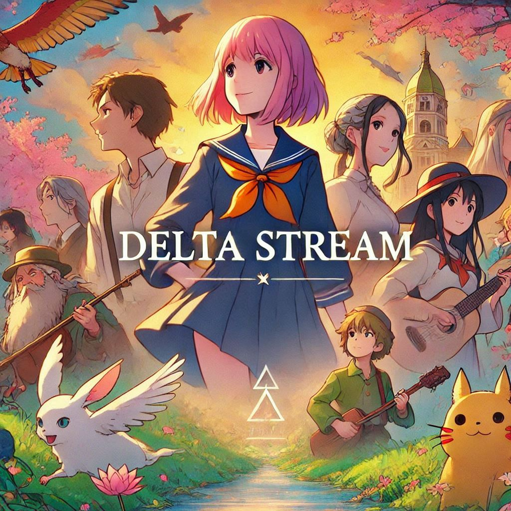

<h1 align="center"><b>Delta Stream</b></h1>

<h4 align="center">
    Memperkenalkan Delta Stream – bot pintar, kuat, dan sederhana untuk pemutaran audio dan video tanpa hambatan di Telegram. Ditulis dalam Python dengan Pyrogram terbaru, Delta Stream memberikan pengalaman hiburan yang superior. Tingkatkan sekarang untuk kinerja optimal dan tingkat kenikmatan Telegram yang baru.<br> Bekerja Dengan Versi Terbaru Pyrogram...
</h4>
<p align="center">
    <a href="https://t.me/Alexa_BotUpdates">
        
    </a>
</p>
<p align="center">
    <a href="https://github.com/kotakbiasa/DeltaMusic"> </a>
    <a href="https://github.com/kotakbiasa/DeltaMusic/commits"> </a>
    <a href="https://github.com/kotakbiasa/DeltaMusic/issues"> </a>
    <a href="https://github.com/kotakbiasa/DeltaMusic/network/members"> </a>  
    <a href="https://pypi.org/project/Pyrogram"> </a>
</p>


<h2 align="center"><b>Perbaikan untuk Pemblokiran IP YouTube dan Kesalahan Masuk</b></h2>

Karena YouTube memblokir IP, kami menemukan solusi. Berikut ini:

• **Jalankan Ekstensi**: Unduh [Firefox](https://www.mozilla.org) dan masuk ke akun YouTube Anda<b>(Disarankan menggunakan akun palsu)</b> lalu jalankan ekstensi yang diunduh di Firefox atau perangkat lunak lainnya untuk menghasilkan cookies.

• **Tambahkan Cookies**: Tempelkan cookies yang dihasilkan di [BatBin](https://batbin.me). Kemudian Anda akan mendapatkan tautan, salin tautan tersebut dan tempelkan tautan Batbin di konfigurasi.

• **Deploy Bot** 


<h1 align="center"><b>Lihat Semua Perintah</b></h1>
<br>

- Dukungan Thumbnail | Audio dan Video
- Gban Pengguna | Menampilkan nama trek saat melewati
- Dukungan pemutaran YouTube, Lokal | Panel pengaturan
- Kontrol dengan tombol | Userbot auto join
- Pemutaran Musik Saluran | Dukungan pemilihan keyboard untuk pemutaran YouTube
- Scrapper Lirik | Antrian Tidak Terbatas
- Bot Siaran | Pengumpul Statistik
- Blokir / Buka Blokir (membatasi pengguna untuk menggunakan bot Anda)

### Lihat Semua Perintah Dasar
<details>
<summary><b>Perintah Dasar</b></summary>
<br>

- `/play <nama lagu>` - memutar lagu yang Anda minta
- `/playlist` - Menampilkan daftar putar saat ini
- `/song <nama lagu>` - unduh lagu yang Anda inginkan dengan cepat
- `/search <kueri>` - cari video di YouTube dengan detail
- `/vsong <nama lagu>` - unduh video yang Anda inginkan dengan cepat
- `/lyric <nama lagu>` - scrapper lirik
- `/vk <nama lagu>` - menghasilkan lagu tanpa mengunduh
</details>

### Hanya Admin yang Dapat Menjalankan
<details>
<summary><b>Perintah Admin</b></summary>
<br>

- `/player` - buka panel pengaturan pemutar musik
- `/pause` - jeda pemutaran lagu
- `/resume` - lanjutkan pemutaran lagu
- `/skip` - putar lagu berikutnya
- `/end` - hentikan pemutaran musik
- `/ping` - periksa status ping bot
- `/auth` - otorisasi orang untuk mengakses perintah admin
- `/deauth` - mencabut otorisasi orang untuk mengakses perintah admin
</details>

### Perintah Sudo
    
<details>
<summary><b>Perintah Sudo</b></summary>
<br>

- `/broadcast` - perintahkan asisten untuk meninggalkan semua grup
- `/gban` - gban pengguna
</details>
    
### Hanya Pemilik
    
<details>
<summary><b>Hanya Pemilik</b></summary>
<br>

- `/broadcast` - kirim pesan siaran dari bot
- `/block` - blokir orang untuk menggunakan bot Anda
- `/unblock` - buka blokir orang yang Anda blokir untuk menggunakan bot Anda
- `/blocklist` - tampilkan daftar semua orang yang diblokir untuk menggunakan bot Anda
</details>


</details>
<h1 align="center"><b>Deployment</b></h1>
Selamat datang di repositori Delta Stream, sebuah platform yang dikembangkan oleh TheTeamAlexa untuk meningkatkan pengalaman musik Anda melalui Delta. Dengan Delta Stream, Anda dapat dengan mudah memerintahkan Delta untuk memutar lagu, artis, dan daftar putar favorit Anda tanpa mengangkat jari.

Tim pengembangan kami telah bekerja tanpa lelah untuk menciptakan pengalaman pengguna yang mulus, mulai dari mengintegrasikan berbagai layanan musik hingga menyediakan perintah suara khusus untuk Delta. Kami percaya bahwa musik memiliki kekuatan untuk menyatukan orang, dan tujuan kami adalah membuatnya semudah dan menyenangkan mungkin.

Melalui repositori ini, kami berharap dapat berbagi hasrat kami untuk musik dan inovasi dengan dunia. Apakah Anda seorang pengembang yang ingin berkontribusi pada proyek open-source kami atau pecinta musik yang bersemangat untuk mencoba Delta Stream, kami menyambut Anda untuk bergabung dengan komunitas kami dan membantu kami membentuk masa depan musik dengan Delta.
<summary><b>Persyaratan</b></summary>
<br>
    
- [Python 3](https://www.python.org/)
- [Kunci API Telegram](https://docs.pyrogram.org/intro/setup#api-keys)
- [Token Bot Telegram](https://t.me/botfather)
- [URI MongoDB](https://telegra.ph/How-To-get-Mongodb-URI-04-06)
- [Sesi String](https://t.me/)

<summary><b>Sesi String</b></summary>
<br>
    
> Anda akan membutuhkan API_ID & API_HASH untuk menghasilkan sesi Pyrogram. 
> Selalu ingat untuk menggunakan kombinasi API yang baik, jika tidak akun Anda bisa dihapus.

<h4> Hasilkan Sesi melalui Repl: </h4>    
<p><a href="https://replit.com/@AssadAli/String-Session-Generator"></a></p>

<h4> Hasilkan Sesi melalui Bot String-Gen Telegram: </h4>    
<p><a href="https://t.me/"></a></p>
<br>

<h4><b>Panduan Hosting Lokal atau VPS</b></h4> 
<br>
<details>
<summary><b>Klik di sini</b> (Ubuntu 20,22)</summary>
<br>

1.  Upgrade dan Update:
```console
sudo apt-get update && sudo apt-get upgrade -y
```

2. Menginstal Paket yang Diperlukan:
```console
sudo apt-get install python3-pip ffmpeg -y
```

3. Menyiapkan PIP
```console
sudo pip3 install -U pip
```

4. Clone Repositori
```console
git clone https://github.com/kotakbiasa/DeltaMusic && cd DeltaMusic
```

5. Instal Persyaratan
```console
pip3 install -U -r requirements.txt
```

6. Buat .env dengan sample.env
```console
cp sample.env .env
```
> Edit .env dengan variabel Anda. 

7. Mengedit Variabel:
```console
vi .env
```
> Edit .env dengan nilai Anda atau Anda dapat menyalin konfigurasi dari sini dan menempelkannya ke notepad Anda, lalu edit dan tempel di sana.
> Tekan tombol I pada keyboard untuk mulai mengedit.
> Tekan Ctrl + C setelah selesai mengedit variabel dan ketik :wq untuk menyimpan .env atau :qa untuk keluar dari pengeditan.

8. Instal Tmux : 
```console
sudo apt install tmux && tmux
```

9. Akhirnya Jalankan Delta Stream Bot
```console
bash start
```
</details>

<br>
<details>
<summary><b>Klik di sini</b> (Ubuntu 24)</summary>
<br>

1.  Upgrade dan Update:
```console
sudo apt-get update && sudo apt-get upgrade -y
```

2. Menginstal Paket yang Diperlukan:
```console
sudo apt-get install python3-pip ffmpeg -y
```

3. Menyiapkan PIP
```console
sudo pip3 install -U pip
```

4. Clone Repositori
```console
git clone https://github.com/kotakbiasa/DeltaMusic && cd DeltaMusic
```

5. Instal Persyaratan
```console
pip install -r requirements.txt --break-system-packages
```

6. Buat .env dengan sample.env
```console
cp sample.env .env
```
> Edit .env dengan variabel Anda. 

7. Mengedit Variabel:
```console
vi .env
```
> Edit .env dengan nilai Anda atau Anda dapat menyalin konfigurasi dari sini dan menempelkannya ke notepad Anda, lalu edit dan tempel di sana.
> Tekan tombol I pada keyboard untuk mulai mengedit.
> Tekan Ctrl + C setelah selesai mengedit variabel dan ketik :wq untuk menyimpan .env atau :qa untuk keluar dari pengeditan.

8. Instal Tmux : 
```console
sudo apt install tmux && tmux
```

9. Akhirnya Jalankan Delta Stream Bot
```console
bash start
```
</details>

<summary><b>Deploy ke Heroku</b></summary>
<br>

> Heroku memiliki dua variabel [HEROKU_API_KEY & HEROKU_APP_NAME] untuk updater agar berfungsi. 
> Dengan mengatur dua variabel tersebut, Anda dapat mendapatkan log aplikasi Heroku Anda, mengatur variabel, mengedit variabel, menghapus variabel, memeriksa penggunaan dyno, dan memperbarui bot. 
> Dua variabel tersebut tidak wajib, Anda juga dapat membiarkannya kosong. 
    
<h4> Klik tombol di bawah ini untuk mendeply Delta di Heroku</h4>    
<p><a href="https://dashboard.heroku.com/new?template=https%3A%2F%2Fgithub.com%2Fkotakbiasa%2FDeltaMusic"></a></p>

<h4>Klik tombol di bawah ini jika Anda menghadapi masalah atau masalah penangguhan akun untuk melewati pembatasan apa pun di Heroku atau Railway</h4>    
<p><a href="https://github.com/kotakbiasa/DeltaMusic-Bypass"></a></p>
<br>

<summary><b>Scalingo</b></summary>
<br>
Sekarang Anda dapat mendeply Delta Stream di Scalingo yang diperkenalkan oleh @ITZ-ZAID
        
<p><a href="https://my.scalingo.com/deploy?template=https://github.com/kotakbiasa/DeltaMusic"> </a></p>

<h1 align="center"><b>Pemilik dan Kredit</b></h1>
<details>
<summary><b>Kredit</b></summary>
<br>

## Kredit Khusus

- [Asad Ali](https://t.me/Dr_Asad_Ali)
- [Logi Lab](https://github.com/LOGI-LAB)
- [Harshit](https://t.me/HarshitSharma361)
- [KSK](https://github.com/KSKOP69) - Untuk meningkatkan Delta ke versi terbaru Pyrogram.
- [Abhimanyu](https://t.me/btwAbhimanyu)
- [Yukki](https://github.com/NotReallyShikhar)
- [Anonymous](https://github.com/AnonymousX1025)
</details>

<details>
<summary><b>Saudara</b></summary>
<br>

- [Abhimanyu](https://t.me/btwAbhimanyu)
- [KSK](https://t.me/EVERYONExKSK)

</details>

<details>
<summary><b>Dukungan</b></summary>
<br>

# Dukungan
<a href="https://t.me/Alexa_BotUpdates"></a>
<a href="https://t.me/Shayri_Music_Lovers"></a>
<a href="https://t.me/Give_Me_Heart"></a>
<a href="https://t.me/Alexa_Help"></a>

</details>


<h1 align="center"><b>Pengakuan</b></h1>

<details>
<summary><b>Perpustakaan</b></summary>
<br>

Terima kasih kepada Anda semua karena telah menggunakan dan membuat Delta:

- [Pyrogram](https://github.com/pyrogram)
- [Py-Tgcalls](https://pypi.org/project/py-tgcalls)
- [Ntgcalls](https://pypi.org/project/ntgcalls)
- [Yt-dlp](https://pypi.org/project/yt-dlp)
</details>


<p align="center">
  <a href="https://www.buymeacoffee.com/theteamalexa">
    
  </a>
</p>


### Asad– Sejarah

<a href="https://www.youtube.com/JankariKiDuniya"></a>


> Terima kasih kepada semua orang yang menggunakan Delta, Itu adalah kesenangan terbesar yang kami miliki!

### Penghitung Tampilan Repo


